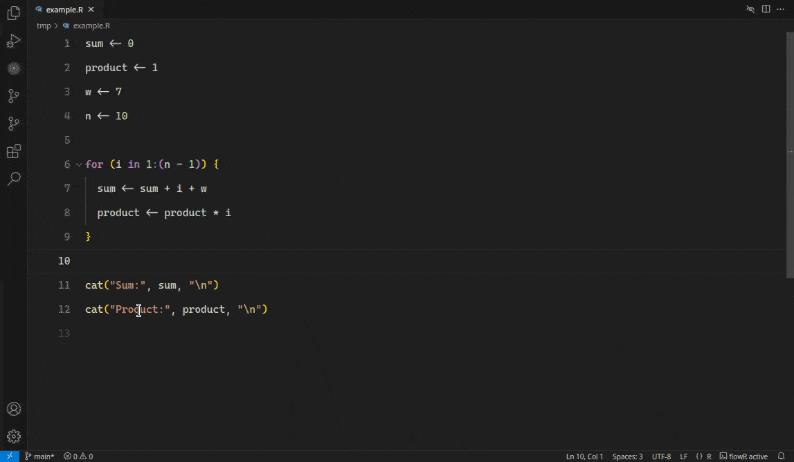
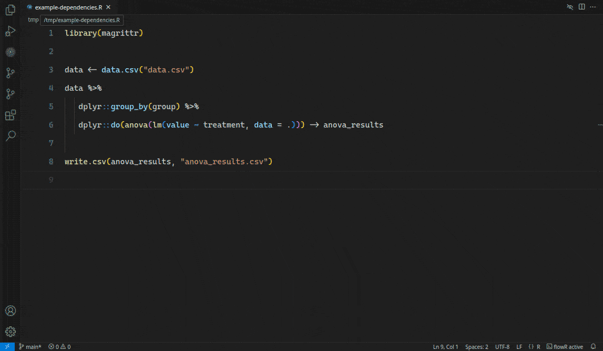
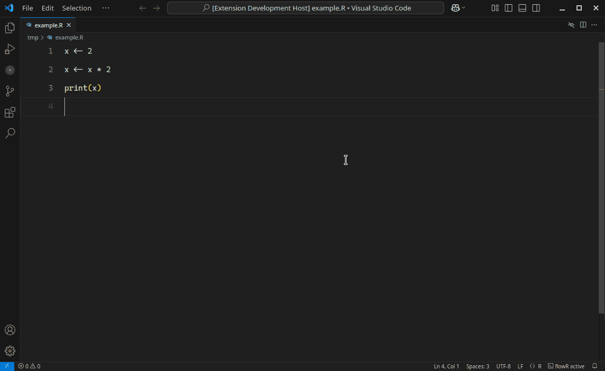
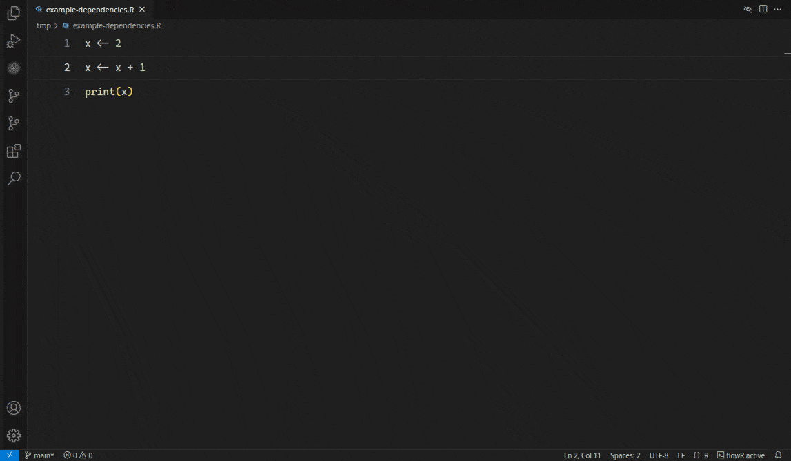
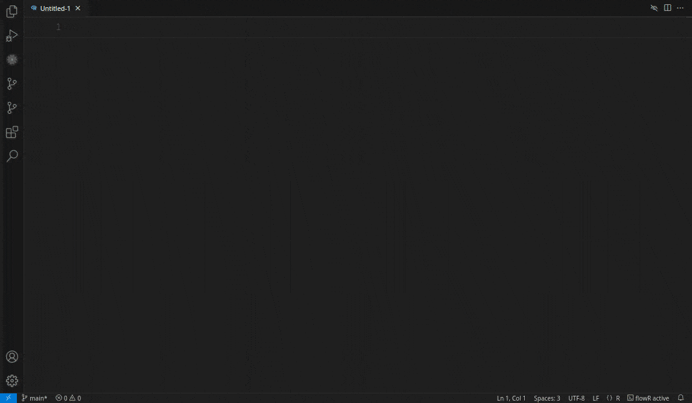
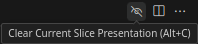
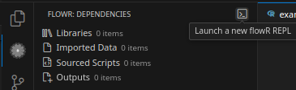
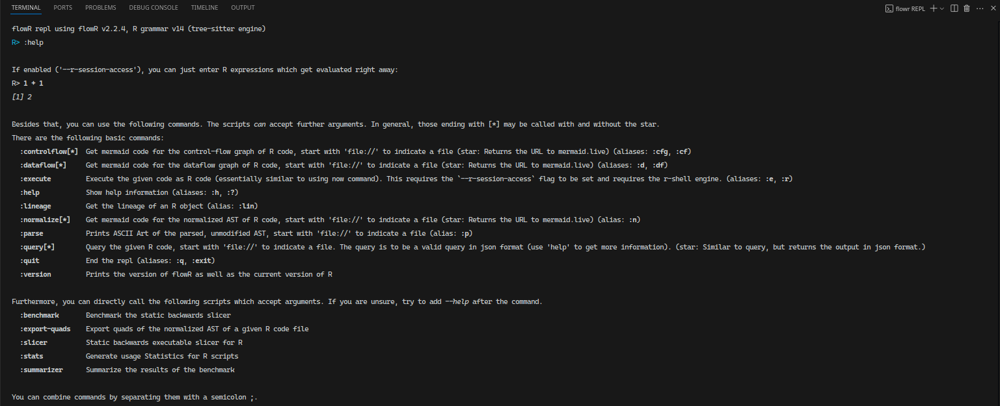
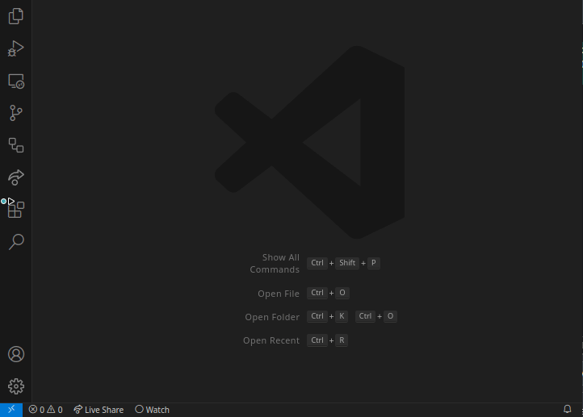

# R Code Analyzer (vscode-flowr)

[](https://marketplace.visualstudio.com/items?itemName=code-inspect.vscode-flowr) [](https://github.com/flowr-analysis/flowr) [](https://vscode.dev)

This extension brings [_flowR_](https://github.com/flowr-analysis/flowr) to Visual Studio Code. See the [installation instructions](#installing) to get started!
With this extension, you gain access to the following features (as extension is under active development, many more features are [planned](https://github.com/flowr-analysis/vscode-flowr/issues?q=is%3Aissue%20state%3Aopen%20type%3AFeature)):

1. 🍕 [**Slicing**](#slicing): Reduce the Program to just the parts relevant to a specific variable or figure.
   This is useful, when you want to reuse code for a figure or statistical analysis in another context or if you just want to understand the code better.

   <details><summary>Slicing Example</summary>

      

   </details>

2. 📚 [**Inspect Dependencies**](#dependency-view): View the library a given script loads, the files it reads and writes, as well as the sourced scripts.
   This helps you understanding what is required to run a script, where it reads data from, and where it writes data to.

   <details><summary>Example of the Dependency View</summary>

      

   </details>

3. 🕸️ [**Dataflow Graph**](#dataflow): Visualize the dataflow in a script.
   This helps you understand how data is transformed in a script and where it is used.
   
   <details><summary>Example of the Dataflow Graph</summary>

      
      
   </details>
   
4. 🧑‍💻 [**flowR REPL Access**](#repl): Explore flowR's capabilities in a REPL (not available in the browser).
   This allows you to interactively explore the features of flowR and understand how it can help you in your daily work.

   <details><summary>Example of the flowR REPL</summary>

      

   </details>

If you notice anything that could be improved, have a feature request, or notice a bug, please [open an issue](#issues-and-feature-requests)!

<details><summary>Reporting an Issue</summary>

   Using the bug icon opens the issue form in your default browser:

   
   
</details>

## Use

This section provides a brief overview of the features provided by this extension and how to use them. See [below](#installing) for instructions on how to install the extension.

### Prerequisites

Installing the extension is sufficient for all features!
Yet, flowR may benefit from a local R installation (which has to be available on your `PATH`) so it can incorporate your local R setup into its analysis.

Additionally, we recommend using the [R extension](https://marketplace.visualstudio.com/items?itemName=REditorSupport.r) for Visual Studio Code along with this extension. For more information on R development in Visual Studio Code, you can also check out [this helpful article](https://code.visualstudio.com/docs/languages/r).

### Slicing

Slicing describes the process of reducing a program to just the parts relevant to a specific variable or figure.
With the extension loaded, select a variable you are interested in and either press <kbd>Alt</kbd>+<kbd>S</kbd> to slice for it once or <kbd>Alt</kbd>+<kbd>P</kbd> to mark the position and continuously update the slice as you edit the file.
The editor will gray out all code that is not part of the generated slice.
By default, the editor will also show you a reconstruction of the slice in a separate view (this can be changed in the settings).

If you want to clear the slice highlight, press <kbd>Alt</kbd>+<kbd>Shift</kbd>+<kbd>C</kbd> or use the icon in the upper right of your editor:



Note, that there are other ways to slice, for example with the [Dependency View](#dependency-view).

#### Detailed Explanation

You can generate a [slice](https://github.com/flowr-analysis/flowr/wiki/Terminology#program-slice) of the currently highlighted variable in any R code by using the "Slice for Cursor Position" command. All code that is not part of the generated slice will then be grayed out.

Optionally, you can also use one of the two "Toggle Continuous Slice" options, which will automatically cause the slice to be updated when code changes occur or when the cursor is moved.

You can also view the reconstruction of a piece of code based on the current slice. The "Show Current Slice in Editor (Reconstruct)" command opens a view next to the current editor that will automatically update the reconstruction as you slice. By default, this should be shown to you automatically whenever you slice (but this can be changed in the settings).

To clear the slice highlighting, use the "Clear Current Slice Presentation" command or the trash icon in the upper right of the editor.


### Dependency View


Using the extension, the sidebar should contain a flowR icon which holds more information on the current file, listing the libraries loaded, the files read and written, and the sourced scripts. If you expand the respective sections, clicking on the found entries should open them in the editor. The context menu (available with a right click) allows you to [slice](#slicing) for the selected entry.

### Dataflow

You can generate and view the dataflow graph for any R source file by using the "Show Dataflow Graph" command while the file is open in the active editor (open the command palette with <kbd>Ctrl</kbd>+<kbd>Shift</kbd>+<kbd>P</kbd> and search for the command). The dataflow graph will then be displayed in an interactive tab on the side, where you can pan and zoom to inspect it. There is also a simplified version that contains less details!

In the future, we plan on including the ability to select nodes in the dataflow graph and have relevant code sections highlighted, and vice versa.


### REPL

flowR offers a [REPL](https://github.com/flowr-analysis/flowr/wiki/Interface#using-the-repl), a "read-eval-print loop", which allows you to interactively explore the features of flowR. You can open a new REPL either with the "Launch a new flowR REPL" command (in the command palette which you can open with <kbd>Ctrl</kbd>+<kbd>Shift</kbd>+<kbd>P</kbd>) or by clicking on the shell icon of the flowR sidebar:



This opens a new terminal in which you can interact with the (local) flowR installation:



## Installing

### From Visual Studio Marketplace

You can get the extension here: <https://marketplace.visualstudio.com/items?itemName=code-inspect.vscode-flowr>.

<details><summary>Example Installation</summary>

   

</details>

### From GitHub Release

You can find official releases of the extension in the [Releases](https://github.com/flowr-analysis/vscode-flowr/releases) section of the repository. Simply select the version you would like to download, open up the asset's section at the bottom, and download the `vscode-flowr-[version].vsix` contained in it.

From Visual Studio Code, open the Extensions tab and click on the three dots in the top right to select "Install from VSIX..." Alternatively, you can use the Command Palette to select the option directly. Then, you can select the `vsix` file you downloaded to install it.

### From Build Artifact

You can easily download the most recent build of the extension by heading to the [Actions tab](https://github.com/flowr-analysis/vscode-flowr/actions/workflows/package.yml), where you will find a list of runs. Selecting the most recent run will display a summary of it, at the bottom of which you can find the Artifacts section and the `Extension vsix` artifact. Download it and unzip it.

Then, you can install it the same way as you would the `vsix` downloaded [from GitHub Releases](#from-github-release).

## Issues and Feature Requests

If you have an issue with the extension or you have a good idea for a new feature, you can create a new issue from within the extension, and it will automatically be populated with some information about your setup.

To do so, simply press the bug-shaped button in the [dependency view](#dependency-view) or use the "Report Issue or Request Feature" command.

## Development

### Building and Running from Source

After cloning the repository, required dependencies can be installed using [npm](https://www.npmjs.com/):

```shell
npm ci
```

Note that this does not install [R](https://www.r-project.org/), which is also not strictly required for development, but (obviously) highly encouraged.

Opening the cloned repository in Visual Studio Code allows using the [existing launch configurations](https://github.com/flowr-analysis/vscode-flowr/blob/main/.vscode/launch.json) which can launch Visual Studio Code with the extension enabled. To use them, open the Run and Debug view and press the Run button at the top, or use the <kbd>F5</kbd> shortcut to start debugging.

You can then open the [example folder](https://github.com/flowr-analysis/vscode-flowr/tree/main/example) contained in this repository to try out the extension for yourself.

To build the extension into a `vsix` file, see [this documentation article](https://code.visualstudio.com/api/working-with-extensions/publishing-extension).

### Git Hooks

This repository contains some git hooks to ensure that linting and other actions happen. Register these hooks by running:

```shell
git config core.hooksPath .githooks
```
